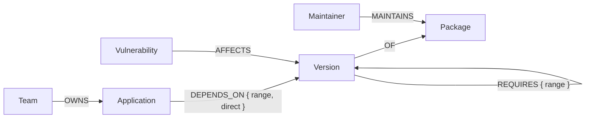
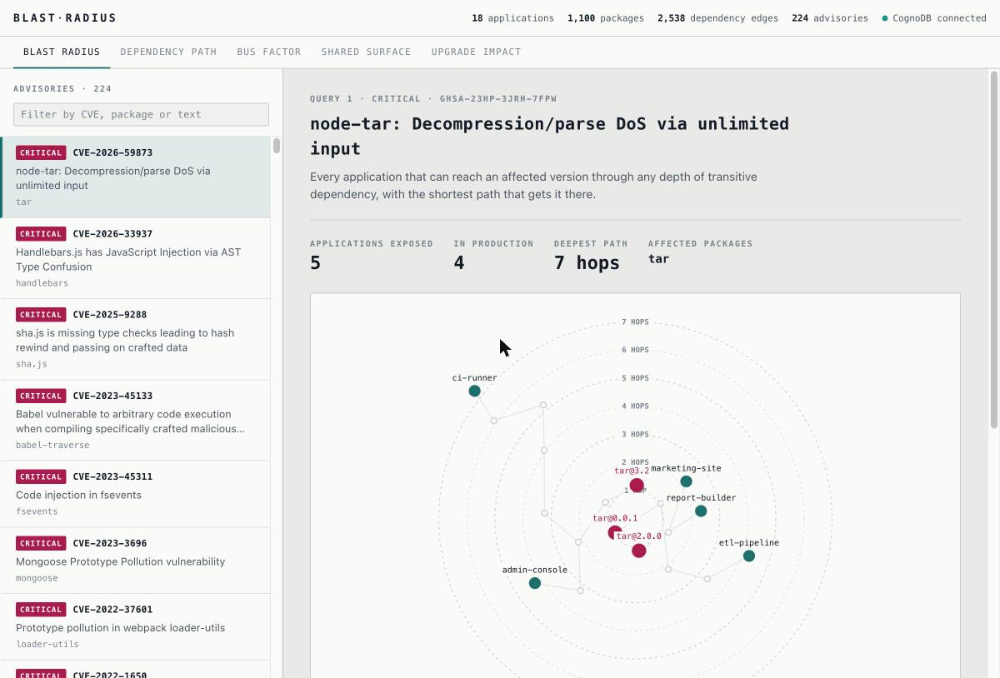
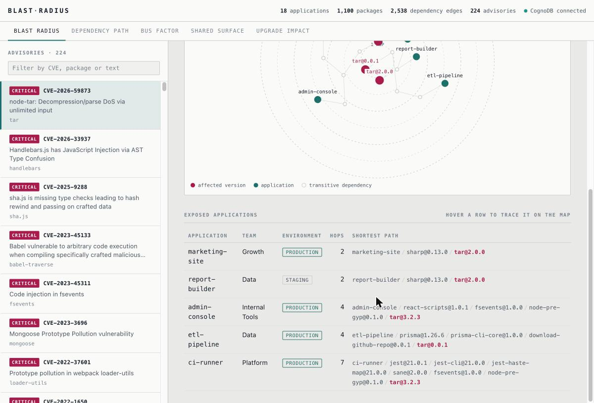
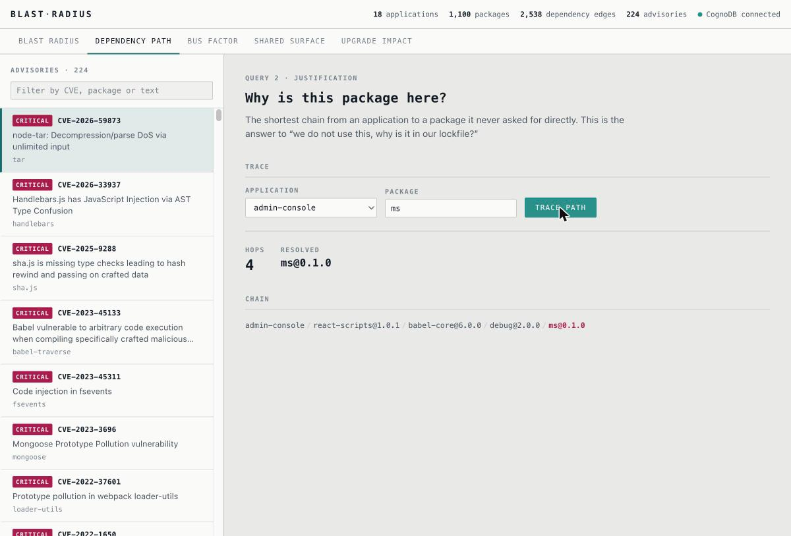
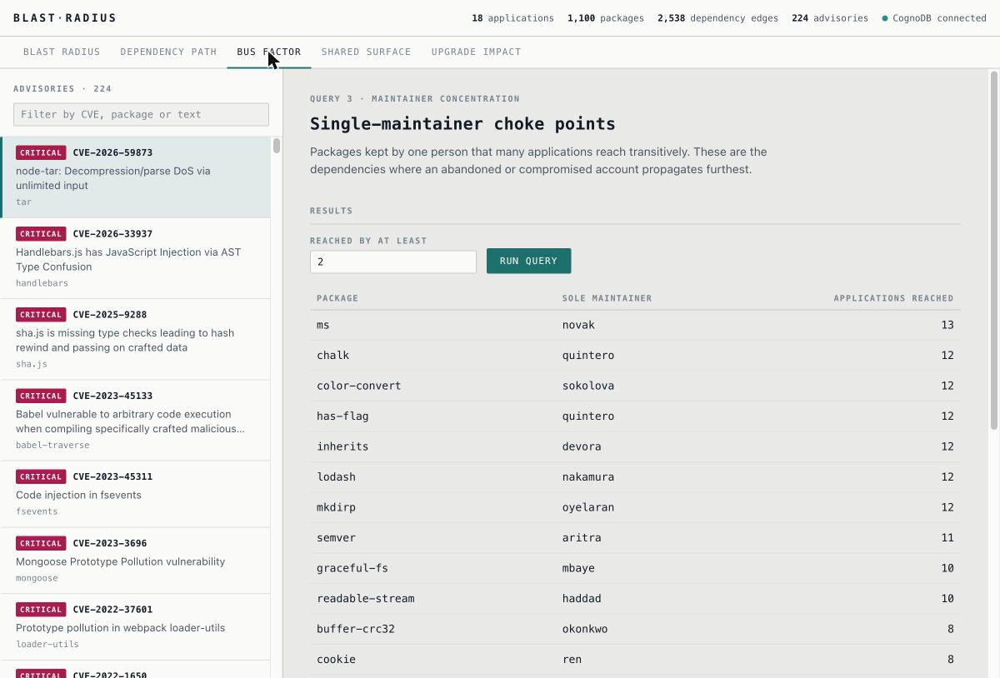
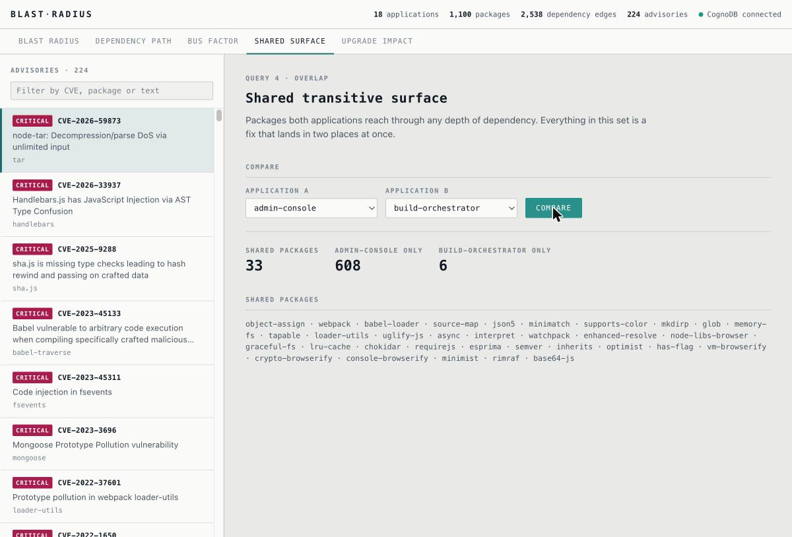
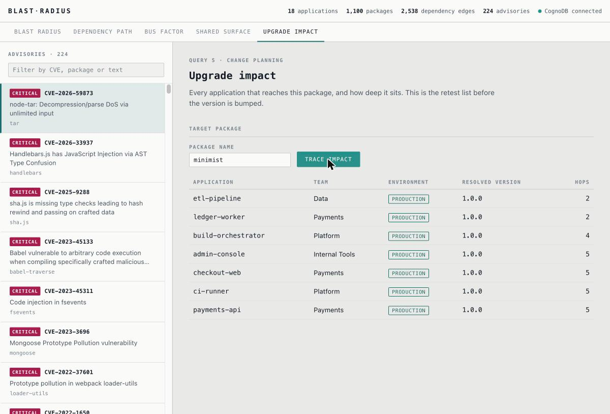

# Blast Radius

A dependency-risk explorer built on **CognoDB Cloud**. Given a security
advisory, it answers the question that actually matters during an incident:
*which of our applications are exposed, and through what chain of dependencies?*

Built for the CognoDB Assignment 2 brief. CognoDB speaks openCypher over Bolt
5.0–5.4, so the entire data layer is the official `neo4j-driver` package with no
vendor shims — see [`server/db.mjs`](server/db.mjs).

**Live demo:** https://blast-radius-production-61fc.up.railway.app

The demo runs against a free `c0` CognoDB Cloud instance seeded with the
committed data. Health check: [`/api/health`](https://blast-radius-production-61fc.up.railway.app/api/health).

---

## The use case

An organisation runs 18 applications. Between them they declare 65 direct
dependencies, which resolve into a tree of 1,405 package versions connected by
2,538 dependency edges. Nobody wrote most of that down, and nobody chose most of
it.

Then an advisory lands on a package that appears in none of the 18 manifests.

The team's actual questions are:

- Which of our applications can reach the affected version at all?
- Through which chain — because "you are exposed via `express → send → mime`" is
  actionable and "you are exposed" is not.
- Which team owns each affected application, and is it in production or staging?
- If we bump this package, what is the retest list?

None of these are lookups. All of them are traversals of unknown depth. Blast
Radius answers all four from a single graph, and renders the answer as a map
where the distance from the centre *is* the hop count.

The application ships five queries covering incident response (blast radius),
lockfile forensics (dependency path), supply-chain concentration risk (bus
factor), consolidation analysis (shared surface) and change planning (upgrade
impact).

---

## Why a graph database?

**1. The core question is variable-length transitive reachability, and the
length is not known in advance.**

The headline query starts at an advisory and asks which applications can reach
an affected version through *any* number of dependency hops. In Cypher that
constraint is written inline:

```cypher
MATCH path = shortestPath( (app:Application)-[:DEPENDS_ON|REQUIRES*1..9]->(bad) )
```

One clause. It also traverses two different relationship types in the same
expansion — `DEPENDS_ON` for the application's own manifest, `REQUIRES` for
everything resolved beneath it — without a union or a type discriminator column.

The relational equivalent is a recursive CTE with a manually maintained
visited-set to stop cycles, a depth column to bound the recursion, and a
self-join per level. It grows less readable with every hop and, more
importantly, the query planner has no way to stop early: it materialises the
full transitive closure and then filters, where the graph engine expands
frontier-by-frontier and stops the moment it reaches the target. On a tree with
2,538 edges the difference is tolerable. On a real organisation's lockfiles it
is the difference between a dashboard and a nightly batch job.

**2. Path identity matters, not just set membership.**

"`checkout-web` is affected" is a fact nobody can act on. "`checkout-web` →
`next@10.0.6` → `postcss@8.1.0` → `nanoid@3.1.0`" tells an engineer exactly
which line of which lockfile to change, and whether the fix is a direct bump or
a plea to an upstream maintainer.

Cypher treats the path as a first-class value. `path` is bound by the match,
`nodes(path)` and `length(path)` are ordinary expressions, and the chain comes
back in the same result row as the application name:

```cypher
chain: [n IN nodes(path) | coalesce(n.name, n.key)]
```

In SQL, reconstructing the path means carrying an accumulating array or string
through every level of the recursion and then parsing it back apart in the
application layer. The result is that most relational implementations quietly
give up on the path and return only membership — which is exactly the part that
makes the answer useless.

**3. Some questions join two independent traversals.**

The bus-factor query intersects an aggregate over the maintainer graph
("packages with exactly one publisher") with an aggregate over an unbounded
dependency traversal ("how many applications can reach this package"). These are
two different traversals rooted at different labels, combined on a shared node.
Relational engines handle this by materialising both sides and hash-joining, and
the traversal side is the recursive CTE from point 1 — so the cost compounds.

In Cypher the two traversals are consecutive `MATCH` clauses sharing a variable,
and the planner keeps the intermediate result as a stream of bindings rather
than a materialised table.

**4. The schema stays honest as the model grows.**

`(:Version)-[:REQUIRES]->(:Version)` is a self-referential many-to-many edge
carrying its own property. In a relational schema that is a join table, and
every additional relationship type in the model is another join table with
another set of foreign keys and another index to maintain. Adding
`(:Maintainer)-[:MAINTAINS]->(:Package)` to this graph was one CSV and one
`MERGE`; the queries that ignore maintainership were not touched and did not
slow down.

---

## Data model



Six labels, six relationship types, roughly 2,772 nodes and 6,224
relationships.

| Node | Key | Count |
|---|---|---|
| `Package` | `name` | 1,100 |
| `Version` | `key` (`name@version`) | 1,405 |
| `Application` | `name` | 18 |
| `Team` | `name` | 5 |
| `Vulnerability` | `id` (GHSA) | 224 |
| `Maintainer` | `handle` | 20 |

| Relationship | Shape | Count |
|---|---|---|
| `REQUIRES` | `Version → Version` | 2,538 |
| `MAINTAINS` | `Maintainer → Package` | 1,862 |
| `OF` | `Version → Package` | 1,405 |
| `AFFECTS` | `Vulnerability → Version` | 336 |
| `DEPENDS_ON` | `Application → Version` | 65 |
| `OWNS` | `Team → Application` | 18 |

The critical split is `Package` versus `Version`. An advisory does not affect
`lodash`; it affects `lodash` at `>=4.0.0 <4.17.21`. Pointing `AFFECTS` at a
specific `Version` is what makes the blast radius precise instead of a list of
every application that touches the package at any version. Full property tables,
constraints, load order and the reasoning behind each modelling choice are in
[`docs/data-model.md`](docs/data-model.md).

### Where the data comes from

The package layer is real. [`data/fetch-sources.mjs`](data/fetch-sources.mjs)
walks the public npm registry from 40 root packages (`express`, `webpack`,
`next`, `puppeteer`, `prisma`, …) to a depth of 6, resolving each declared
range and recording the graph it finds. Advisories are real too — pulled from
[OSV.dev](https://osv.dev), hydrated individually, and attached only where the
advisory's own `introduced`/`fixed` range events actually contain a version
present in the graph.

Ranges are resolved to the *lowest* published version in the declared major.
That models a lockfile that has not been refreshed in years, which is both the
scenario the tool exists for and the reason real historical CVEs land on real
nodes here rather than on nothing.

The `Team`, `Application` and `Maintainer` layers are synthetic but
deterministic: the fetcher produces byte-identical CSVs on every run. The
resulting CSVs are committed under `data/`, so seeding needs no network access
and the graph is reproducible by anyone cloning the repository.

---

## Setup

### 1. Create the CognoDB instance

1. Go to **<https://console.cognodb.com/signup>** and create an account. The
   free tier does not ask for a credit card.
2. From the console, choose **Create instance** and select the free **`c0`**
   size.
3. Pick the region closest to you — this is a latency choice only; every tier
   speaks the same Bolt protocol.
4. When the instance finishes provisioning, the console shows the connection
   details:
   - a connection URI of the form
     `bolt+s://<instance-id>.databases.cognodb.cloud`
   - the username `cognodb`
   - a generated password

   **The password is shown exactly once.** Copy it before closing the dialog. If
   you lose it, reset it from the instance's settings page — there is no way to
   read it back.
5. Wait for the instance status to read *Running* before continuing. A `c0`
   typically takes under a minute.

### 2. Configure credentials

```bash
cp .env.example .env
```

Fill in the two values you just saved:

```ini
COGNODB_URI=bolt+s://<instance-id>.databases.cognodb.cloud
COGNODB_USER=cognodb
COGNODB_PASSWORD=<generated-password>
```

Nothing is hard-coded. Every connection setting is read from the environment by
[`server/db.mjs`](server/db.mjs), and real environment variables take precedence
over the file, so the same build runs unchanged on a hosting platform that
injects config directly. `.env` is listed in `.gitignore` and is never
committed.

### 3. Install and verify

```bash
npm install          # Node 20 or newer
npm run check        # opens a Bolt session and prints the negotiated protocol version
```

A successful check prints something like
`Connected: <host>:7687, Bolt 5.4`. A failure prints the driver's message and
points at `.env` rather than dumping a stack trace.

### 4. Seed the graph

```bash
npm run seed
```

This creates the six uniqueness constraints, then loads the ten CSVs in
dependency order using batched `UNWIND … MERGE` writes. It is idempotent —
every write merges on a constrained key, so re-running converges rather than
duplicating. It finishes by printing the node and relationship counts it can
see.

To start from an empty database:

```bash
npm run seed -- --wipe
```

Expect roughly 2,772 nodes and 6,224 relationships when it completes.

### 5. Run the checks

```bash
npm run smoke
```

Runs all five queries against the live instance and asserts the results are
shaped the way the UI expects. The interesting assertion is the depth one: the
brief requires a genuine multi-hop traversal, so a run where no application is
at least **3 hops** from an affected version is reported as a failure of the
seed data even though every query technically succeeded.

### 6. Start the application

```bash
npm run build:web
npm start
```

The app is at **<http://localhost:4173>**. The server binds `127.0.0.1` only.

For development with hot reload, run the two halves separately:

```bash
npm run dev:server    # node --watch on the Fastify API, port 4173
npm run dev:web       # Vite dev server on port 5174, proxying /api to 4173
```

### 7. Optional: build the portable Windows package

```bash
npm run package:windows
```

Produces `package/build/BlastRadius-windows.zip`, containing the server bundled
to a single CommonJS file by esbuild, the built frontend, and a pinned portable
`node.exe`. The recipient unzips it and double-clicks `START.bat` — no Node
install, no admin rights, no PATH changes, no Docker. The zip embeds a real
`.env`, which is why `package/build/` and `*.zip` are both gitignored.

---

## The queries

Every Cypher statement in the application lives as a named export in
[`server/queries.mjs`](server/queries.mjs) and receives its inputs as `$`
parameters bound by the driver. Nothing is assembled by string concatenation
anywhere in the codebase, so a request parameter can change what a query
*matches* but never what it *does*.

Traversal depth caps (`*1..9`, `*1..7`, `*1..6`) are deliberate. They sit well
above the depth real dependency trees reach while bounding worst-case work on a
free `c0` instance.

### 1. Blast radius — the headline query

*Multi-hop traversal, and the one a relational database handles badly.*

**Question:** advisory GHSA-xxxx just dropped. Which applications are exposed,
how far away are they, and through what chain?

```cypher
MATCH (vuln:Vulnerability {id: $vulnerabilityId})-[:AFFECTS]->(bad:Version)-[:OF]->(badPkg:Package)
MATCH path = shortestPath( (app:Application)-[:DEPENDS_ON|REQUIRES*1..9]->(bad) )
OPTIONAL MATCH (team:Team)-[:OWNS]->(app)
WITH app, team, badPkg, bad, path, length(path) AS hops
ORDER BY hops ASC
WITH app, team,
     collect({
       hops: hops,
       viaPackage: badPkg.name + '@' + bad.version,
       chain: [n IN nodes(path) | coalesce(n.name, n.key)]
     }) AS routes
RETURN app.name        AS application,
       app.env         AS env,
       team.name       AS team,
       routes[0].hops       AS hops,
       routes[0].viaPackage AS viaPackage,
       routes[0].chain      AS chain,
       size(routes)         AS affectedPaths
ORDER BY hops ASC, application ASC
```

Reading it in order: start from the advisory and expand to every version it
affects. From each of those, find the shortest path back to any application
across one to nine hops of `DEPENDS_ON` or `REQUIRES`. Attach the owning team.
Sort the routes for each application by length, collect them, and return the
shortest one as the justification plus a count of how many distinct routes exist.

`affectedPaths > 1` is a genuinely useful signal: it means the package arrives
through more than one branch of the tree, so a single upstream bump will not
remove the exposure.

An accompanying query, `BLAST_RADIUS_GRAPH`, runs the same traversal and reshapes
the result into `{nodes, links}` for the visualisation, flagging which nodes are
the affected versions.

**Why this is awkward relationally:** the traversal length is unknown, both edge
types must be walked in one expansion, cycles must not hang it, and the *path*
must survive into the result set. A recursive CTE can be made to do it, but it
materialises the closure before filtering, needs an explicit visited-set, and
has to accumulate the chain into an array column that the application layer then
unpacks. The Cypher above is the whole implementation.

### 2. Dependency path — why is this in our lockfile?

```cypher
MATCH (app:Application {name: $applicationName})
MATCH (target:Version)-[:OF]->(pkg:Package {name: $packageName})
MATCH path = shortestPath( (app)-[:DEPENDS_ON|REQUIRES*1..9]->(target) )
WITH path, target, pkg, length(path) AS hops
ORDER BY hops ASC
LIMIT 1
RETURN hops                                          AS hops,
       pkg.name + '@' + target.version               AS resolved,
       [n IN nodes(path) | coalesce(n.name, n.key)]  AS chain,
       [r IN relationships(path) | type(r)]          AS edgeTypes
```

The forensic counterpart to query 1. You know a package is in your tree; you
want the shortest justification for its presence. Returning `edgeTypes`
alongside the chain distinguishes "you declared this yourself" (first edge is
`DEPENDS_ON`) from "something you declared dragged it in" (everything after is
`REQUIRES`).

### 3. Bus factor — concentration risk

*Two independent traversals joined on a shared node.*

```cypher
MATCH (m:Maintainer)-[:MAINTAINS]->(pkg:Package)
WITH pkg, count(DISTINCT m) AS maintainerCount, collect(DISTINCT m.handle)[0] AS soleMaintainer
WHERE maintainerCount = 1
MATCH (pkg)<-[:OF]-(v:Version)
MATCH (app:Application)-[:DEPENDS_ON|REQUIRES*1..6]->(v)
WITH pkg, soleMaintainer, count(DISTINCT app) AS reachingApplications
WHERE reachingApplications >= $minApplications
RETURN pkg.name             AS package,
       soleMaintainer       AS maintainer,
       reachingApplications AS reachingApplications
ORDER BY reachingApplications DESC, package ASC
LIMIT $limit
```

Which single-maintainer packages does the most of our estate depend on? This is
supply-chain risk that no advisory feed will ever tell you about — the packages
where one person's compromised npm token, or one person's burnout, is an
organisation-wide event.

The first aggregate runs over the maintainer graph and narrows to sole-maintainer
packages. The second counts how many applications can transitively reach any
version of those packages. Both sides are aggregates, one of them over an
unbounded traversal, and they meet on `pkg`.

The depth cap here is 6 rather than 9 because this query has no anchor — it
expands from every application over every candidate package, so it is the most
expensive of the five and the one worth bounding tighter on a free instance.

### 4. Shared surface — what do two applications have in common?

```cypher
MATCH (a:Application {name: $applicationA})-[:DEPENDS_ON|REQUIRES*1..7]->(:Version)-[:OF]->(p:Package)
WITH collect(DISTINCT p.name) AS aPackages
MATCH (b:Application {name: $applicationB})-[:DEPENDS_ON|REQUIRES*1..7]->(:Version)-[:OF]->(q:Package)
WITH aPackages, collect(DISTINCT q.name) AS bPackages
WITH aPackages, bPackages, [n IN aPackages WHERE n IN bPackages] AS shared
RETURN shared                     AS sharedPackages,
       size(shared)               AS sharedCount,
       size(aPackages)            AS aCount,
       size(bPackages)            AS bCount,
       size([n IN aPackages WHERE NOT n IN bPackages]) AS aOnlyCount,
       size([n IN bPackages WHERE NOT n IN aPackages]) AS bOnlyCount
```

Two full transitive closures, intersected. A high shared count means the two
services will be hit by the same advisories and can be patched together; a low
one means they are genuinely independent and a shared platform library would be
premature. Note this one deliberately compares at the `Package` level, not
`Version` — for consolidation planning "we both use `lodash`" is the useful
grain even when the resolved versions differ.

### 5. Upgrade impact — the retest list

```cypher
MATCH (target:Version)-[:OF]->(pkg:Package {name: $packageName})
WHERE $version IS NULL OR target.version = $version
MATCH path = shortestPath( (app:Application)-[:DEPENDS_ON|REQUIRES*1..9]->(target) )
OPTIONAL MATCH (team:Team)-[:OWNS]->(app)
WITH app, team, target, length(path) AS hops
ORDER BY hops ASC
WITH app, team, collect({hops: hops, version: target.version}) AS routes
RETURN app.name          AS application,
       app.env           AS env,
       team.name         AS team,
       routes[0].hops    AS hops,
       routes[0].version AS resolvedVersion
ORDER BY hops ASC, application ASC
```

The forward-looking version of query 1: you are about to bump a package, so who
has to retest? `$version` is optional — pass it to scope the answer to one
release, omit it to cover every version of the package present in the graph.
Because the result carries `env` and `team`, the output is directly a
notification list.

### Supporting queries

`LIST_VULNERABILITIES`, `LIST_APPLICATIONS`, `SEARCH_PACKAGES` and `OVERVIEW`
populate the UI's pickers and header counters. `SEARCH_PACKAGES` orders by name
length so that typing `lod` surfaces `lodash` before `lodash.mergewith`.

### Parameterisation

Every query above takes `$`-prefixed parameters and is invoked through
[`server/db.mjs`](server/db.mjs)'s `read(cypher, params)` helper, which binds
them via the driver's own parameter mechanism inside an `executeRead`
transaction. HTTP handlers in [`server/routes.mjs`](server/routes.mjs) validate
and coerce inputs before they reach the driver, and reject blank required fields
with a 400. There is no code path in the project where user input becomes part
of a Cypher string.

---

## Handling an unreachable database

The database is remote, over TLS, on someone else's infrastructure. It will be
unreachable sometimes, and the app treats that as an expected state rather than
an exception.

- `verifyConnectivity()` wraps `driver.getServerInfo()` and returns a structured
  `{ok, address, protocol}` or `{ok: false, configured, error}` — it never
  throws.
- `isConnectivityError()` classifies driver failures — `ServiceUnavailable`,
  `SessionExpired`, auth rejections, `ECONNREFUSED`, `ENOTFOUND`, `EAI_AGAIN`,
  `ETIMEDOUT` — and only those are converted into `DatabaseUnavailableError`. A
  genuine query bug still surfaces as a query bug.
- Missing or blank credentials raise `ConfigurationError`, which is reported
  distinctly from "configured but unreachable" so the message can tell the user
  *which* thing to fix.
- Every HTTP handler runs through a `guard()` wrapper that maps those two error
  classes onto a **503** with a plain-language message, bad input onto a 400,
  and everything else onto a 500. No stack trace ever reaches the browser.
- **The server starts anyway.** If the database is unreachable at boot, startup
  logs a warning and continues to listen. The UI renders a banner, keeps polling
  `/api/health`, and recovers on its own when the instance comes back. For the
  non-technical recipient of the Windows build, a running app that explains the
  problem is worth considerably more than a process that exited before the
  browser opened.
- `npm run check` and `npm run seed` take the opposite stance and exit non-zero
  with a message pointing at `.env`, because a scripted load should fail loudly.

---

## Screenshots

*Captured from a live run against a free `c0` CognoDB Cloud instance with the
committed seed data.*


Selecting an advisory lists every reachable application with its hop count, owning team, environment, and the dependency chain that justifies the result.


The same traversal as a force-directed map: affected versions at the centre, applications pushed out to the ring matching their hop distance.


"Why is this in our lockfile?" — the shortest path from an application to a package, annotated with the edge type at each step.


Single-maintainer packages ranked by how many applications transitively reach them.


The intersection of two applications' full transitive closures, with the size of each side's exclusive set.


Pick a package and version, get the list of applications and teams that need to retest.

---

## Interface

The UI is a five-tab React application served by the same Fastify process that
exposes the API.

Type is mono-led throughout. Nearly every string on screen is a package
identifier, a semver number, a GHSA identifier or a count — content where
character alignment and digit disambiguation carry meaning, and where a
proportional face makes `1.0.10` and `1.0.1` harder to tell apart than they
should be. Prose gets a sans face; identifiers, labels and counts get mono with
deliberate letter-spacing.

The blast map is a force-directed canvas, but not a free one. Alongside the
usual link, charge and collision forces, a radial force pins every node to the
concentric ring matching its breadth-first hop distance from the affected
version, and each ring is drawn and labelled with its hop count. The consequence
is that traversal depth reads directly off the canvas — an application on ring 4
is four hops away, and you can see that without reading a single label. An
unconstrained force layout of the same data produces a hairball in which the one
number driving the decision is invisible.

---

## Project layout

```
data/
  fetch-sources.mjs      npm registry + OSV.dev walker; writes the CSVs
  *.csv                  committed seed data (10 files)
scripts/
  seed.mjs               constraints + batched idempotent load; --check, --wipe
  smoke.mjs              runs all five queries, asserts shape and traversal depth
server/
  db.mjs                 driver lifecycle, connectivity classification, read()
  env.mjs                dependency-free .env loader; real env vars win
  queries.mjs            every Cypher statement, all parameterised
  routes.mjs             Fastify routes with the 503/400/500 guard
  index.mjs              startup, static hosting, graceful shutdown
web/src/
  App.jsx                shell, tabs, health banner
  panels.jsx             one panel per query
  BlastMap.jsx           radial force-directed canvas
  styles.css             mono-led type system
package/
  build-windows.mjs      portable zip builder (esbuild + pinned node.exe)
```

### npm scripts

| Script | What it does |
|---|---|
| `npm run check` | Verifies connectivity and prints the negotiated Bolt version |
| `npm run seed` | Creates constraints and loads the CSVs (`-- --wipe` to reset first) |
| `npm run smoke` | Runs all five queries and asserts the results |
| `npm run fetch-sources` | Regenerates the CSVs from npm and OSV (needs network) |
| `npm run build:web` | Builds the frontend with Vite |
| `npm start` | Starts the server on port 4173 |
| `npm run dev:server` | API with `node --watch` |
| `npm run dev:web` | Vite dev server |
| `npm run package:windows` | Builds the portable Windows zip |

---

## Known limitations and trade-offs

**npm range resolution is a heuristic, not a solver.** `resolveRange()` in
`data/fetch-sources.mjs` picks the lowest published version matching the
declared major rather than running a real semver constraint solver. This is
documented in the source. It is wrong in the general case — it ignores
pre-release tags, `||` unions, `>=x <y` compound ranges and peer-dependency
resolution — and the resulting tree is not the tree npm would install today. It
*is* a plausible tree, and specifically a plausible *stale* one, which is the
scenario the tool addresses. Making it correct would mean vendoring a semver
resolver, which would improve the seed data without changing anything about the
graph model or the queries.

**The organisational layer is synthetic.** Real package data, real advisories,
invented company. The 18 applications, 5 teams and their root dependency
choices are a fixed table in the fetcher, and maintainer assignment is a hash
of the package name rather than the registry's actual maintainer records. It is
deterministic and plausible, but the bus-factor results describe fictional
people. Swapping in a real internal service inventory would be a change to one
CSV.

**Traversal depths are capped.** `*1..9` for the path queries, `*1..7` for
shared surface, `*1..6` for bus factor. Real dependency trees rarely exceed six
levels of genuinely distinct packages, so these caps do not truncate meaningful
results in this dataset — but they are caps, and on a much larger graph an
application at hop 10 would be silently missing rather than reported. The bound
is there to keep worst-case work predictable on a free `c0` instance; a paid
instance would justify raising or removing it.

**Advisories are capped at four per package** during collection, and the
hydration list is truncated at 500 before range matching. For a package with a
long advisory history this means the graph holds a sample rather than the full
record.

**The frontend is plain JSX, not TypeScript.** At this size the type safety
would not have caught anything the smoke test does not, and the build stays a
single Vite pass with no type-check step. On a codebase meant to be maintained
by more than one person that trade would go the other way.

**The Windows package embeds live credentials.** The portable zip contains a
real `.env`, because the whole point is that the recipient does not configure
anything. That makes the artefact a secret, which is why `package/build/` and
`*.zip` are gitignored — but it means the zip must be distributed with the same
care as the password itself.

**Single database, no write path from the UI.** The application is read-only by
design; there is no ingestion pipeline that keeps the graph current as new
advisories are published. Refreshing means re-running `fetch-sources` and
`seed`.
