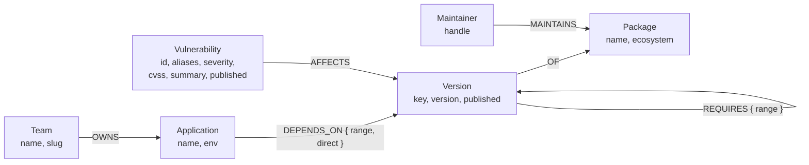

# Data model

Blast Radius stores a single connected graph: the dependency structure of an
organisation's applications, the advisories that land on individual package
versions, and the people who maintain those packages. Every query in the
application is a traversal over this one model — there are no side tables and no
denormalised rollups.

## The graph at a glance



The self-loop on `Version` is the important edge. `REQUIRES` is what turns a
flat inventory into a graph: a version points at the specific versions of other
packages it pulls in, and those point at more, and the chain continues until it
bottoms out in leaf packages. In the seeded dataset there are 2,538 of these
edges connecting 1,405 versions, and the resulting trees are deep enough that
several applications sit four or more hops away from packages they have never
heard of.

## Node labels

| Label | Key property | Other properties | Count | What it represents |
|---|---|---|---|---|
| `Package` | `name` (unique) | `ecosystem` | 1,100 | A package identity in a registry, independent of any release. `ecosystem` is `npm` throughout the seeded data, and exists so the model can hold PyPI or Maven packages without a schema change. |
| `Version` | `key` (unique) | `version`, `published` | 1,405 | One published release. `key` is the canonical `name@version` string (`express@3.5.0`); `version` is the bare semver; `published` is the release date as `YYYY-MM-DD` (empty when the registry did not report one). |
| `Application` | `name` (unique) | `env` | 18 | A deployable service or site owned by the organisation. `env` is `production` or `staging`, which is what turns a raw hop count into a prioritisation signal. |
| `Team` | `name` (unique) | `slug` | 5 | The owning group. `slug` is the join key used by the loader; `name` is what the UI displays. |
| `Vulnerability` | `id` (unique) | `aliases`, `severity`, `cvss`, `summary`, `published` | 224 | A published security advisory. `id` is the GHSA identifier, `aliases` is a list of CVE identifiers, `cvss` is the full vector string, and `severity` is the advisory database's own rating (`CRITICAL`, `HIGH`, `MODERATE`, `LOW`). |
| `Maintainer` | `handle` (unique) | — | 20 | A registry account with publish rights on a package. |

Total: approximately 2,772 nodes.

## Relationship types

| Type | From → To | Properties | Count | What it represents |
|---|---|---|---|---|
| `OWNS` | `Team` → `Application` | — | 18 | Ownership. Used to attach a name to every row of the blast-radius result, so the output is a list of teams to notify rather than a list of repositories. |
| `DEPENDS_ON` | `Application` → `Version` | `range`, `direct` | 65 | A dependency declared in the application's own manifest. `range` is the semver range as written (`^10.0.6`); `direct` is `true` on every one of these edges, marking them as first-party declarations rather than resolved transitive ones. |
| `OF` | `Version` → `Package` | — | 1,405 | Binds a release to its package identity. Exactly one per `Version`. |
| `REQUIRES` | `Version` → `Version` | `range` | 2,538 | A resolved transitive dependency: this specific release pulls in that specific release. `range` preserves the range the parent actually declared, so the resolution decision stays auditable after the fact. |
| `AFFECTS` | `Vulnerability` → `Version` | — | 336 | An advisory applies to this exact release. |
| `MAINTAINS` | `Maintainer` → `Package` | — | 1,862 | Publish rights. Attached to `Package` rather than `Version` because maintainership is a property of the account that owns the name, not of any single release. |

Total: approximately 6,224 relationships.

## Why `Version` is separate from `Package`

This is the single most consequential modelling decision in the project, and
collapsing the two would quietly break the application's core claim.

A CVE does not affect `lodash`. It affects `lodash` at versions `>=4.0.0
<4.17.21`, and the whole value of the tool is being able to say "you are on
`4.17.15`, you are exposed" versus "you are on `4.17.21`, you are fine". If
`AFFECTS` pointed at `Package`, every application that touches `lodash` anywhere
in its tree would light up on every `lodash` advisory ever published — an alert
volume that trains people to ignore alerts. Pointing `AFFECTS` at `Version`
makes the edge precise: it exists only between an advisory and the specific
releases the advisory's own range predicate matched, computed at seed time by
[`data/fetch-sources.mjs`](../data/fetch-sources.mjs) against the OSV range
events.

The same precision requirement runs down the `REQUIRES` chain. Two applications
can both depend on `express`, resolve it to different versions, and reach
completely different versions of `qs` four hops down. If the traversal ran over
package identities the two would be indistinguishable; running it over versions
means each application's actual resolved tree is walked, and the path returned
in the UI is the path that really exists in that lockfile.

Separating the two also gives each concept a clean home for the properties that
genuinely belong to it. Release date and semver string belong to a release.
Ecosystem, maintainership and the human-facing name belong to the package. Merging
them would force one node to carry a list of versions as a property, which is
exactly the shape that makes range containment un-queryable.

The cost of the separation is one extra hop — every "which package is this?"
question traverses `OF`. That is a single indexed lookup against a uniqueness
constraint, and it buys the ability to answer the question the tool exists for.

## Constraints and indexes

[`scripts/seed.mjs`](../scripts/seed.mjs) creates six uniqueness constraints
before loading anything:

```cypher
CREATE CONSTRAINT package_name        IF NOT EXISTS FOR (p:Package)       REQUIRE p.name   IS UNIQUE;
CREATE CONSTRAINT version_key         IF NOT EXISTS FOR (v:Version)       REQUIRE v.key    IS UNIQUE;
CREATE CONSTRAINT application_name    IF NOT EXISTS FOR (a:Application)   REQUIRE a.name   IS UNIQUE;
CREATE CONSTRAINT team_name           IF NOT EXISTS FOR (t:Team)          REQUIRE t.name   IS UNIQUE;
CREATE CONSTRAINT vulnerability_id    IF NOT EXISTS FOR (v:Vulnerability) REQUIRE v.id     IS UNIQUE;
CREATE CONSTRAINT maintainer_handle   IF NOT EXISTS FOR (m:Maintainer)    REQUIRE m.handle IS UNIQUE;
```

Each constraint carries a backing index, which is what makes the loader's
`MERGE` pattern both correct and fast. Every write in the seed script is a
`MERGE` on a constrained key, so re-running the loader converges on the same
graph rather than duplicating it — the constraints are what make idempotency a
property of the schema rather than a property of the script's control flow.

The traversal entry points (`Vulnerability.id`, `Application.name`,
`Package.name`, `Version.key`) are all constrained, so every query starts from
an index seek and only the variable-length expansion is real work.

## Load order

The loader runs the CSVs in dependency order so that every `MATCH` in a later
step has something to bind to:

1. `packages.csv` — `Package` nodes
2. `versions.csv` — `Version` nodes and their `OF` edges
3. `requires.csv` — `REQUIRES` edges between versions
4. `teams.csv` — `Team` nodes
5. `applications.csv` — `Application` nodes and their `OWNS` edges
6. `depends_on.csv` — `DEPENDS_ON` edges
7. `vulnerabilities.csv` — `Vulnerability` nodes
8. `affects.csv` — `AFFECTS` edges
9. `maintainers.csv` — `Maintainer` nodes
10. `maintains.csv` — `MAINTAINS` edges

Rows are sent in batches of 1,000 with `UNWIND $rows AS row`, so the 2,538
`REQUIRES` edges load in three round trips rather than 2,538.

## Data provenance

The package layer is real. `data/fetch-sources.mjs` walks the public npm
registry from 40 root packages to a maximum depth of 6, following each
package's declared `dependencies` and recording the resolved graph. Advisories
are real too: the script queries [OSV.dev](https://osv.dev) for every package
name in the graph, hydrates each advisory, and keeps only those whose
`introduced`/`fixed` range events actually contain a version present in the
graph. An advisory that matches nothing is discarded rather than attached
loosely, which is why all 224 `Vulnerability` nodes have at least one `AFFECTS`
edge.

Range resolution picks the *lowest* published version within the declared
major rather than the highest — the code documents this at the `resolveRange`
function. That is a deliberate simplification with a realistic justification: it
models a lockfile nobody has refreshed in years, which is both the situation the
tool is built for and the reason real historical CVEs land on real nodes in this
graph instead of on none of them.

The `Team`, `Application` and `Maintainer` layers are synthetic, because no
organisation's internal service inventory is public. They are generated
deterministically — applications and their root dependencies are a fixed table
in the source, and maintainer assignment is a hash of the package name — so
re-running the fetcher produces byte-identical CSVs.
